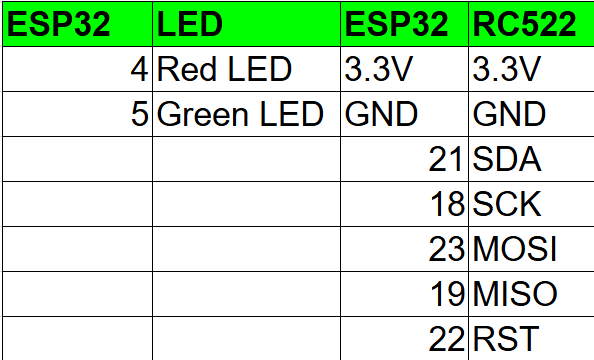

# 🔐 ESP32 + RC522 RFID Access Control System

A smart access control system using **ESP32**, **RFID RC522**, **Google Sheets**, and **Wi-Fi** — perfect for labs, hostels, or small offices! Logs entries automatically to a Google Sheet, with **green/red LED feedback** for authorized/unauthorized users.

> 🎥 **Demo Video**: [Watch on YouTube](https://your-youtube-link-here.com)

---

## 📦 Features

- ✅ RFID-based access validation  
- ☁️ Real-time logging to Google Sheets via Apps Script  
- 🔴 Red & 🟢 Green LED feedback  
- 🔐 Modular secrets file  
- 📶 Wi-Fi connectivity

---

## 🔌 Hardware Connections

Here's the wiring diagram for connecting **ESP32 ↔ RC522** and LEDs:



---

### 💡 ESP32 to LEDs

```c
#define RED_LED    4
#define GREEN_LED  5
```

📝 Use a 220Ω resistor with each LED to avoid burning them out.

## 🧾 How to Set Up the Google Sheets App Script

1. **Open your Google Sheet** Create a new sheet to store RFID scan logs.
2. **Open Apps Script Editor** Go to `Extensions` → `Apps Script`.
3. **Paste the Script** Replace any existing code with the content from `code/sheeets_app_script.gs`.
4. **Deploy the Script**
   * Click `Deploy` → `New deployment`
   * Select type: **Web App**
   * Description: `RFID Logger`
   * Execute as: `Me`
   * Who has access: `Anyone`
   * Click **Deploy**, and allow permissions.
5. **Copy the Web App URL**
   * Paste this URL into your `secrets.h` file.

## ⚠️ Security Notes

* Keep your `secrets.h` file private — it contains credentials and API endpoints.
* When pushing to GitHub, ensure only placeholder values like:

```c
#define WIFI_SSID "your_wifi"
#define WIFI_PASSWORD "your_password"
#define SCRIPT_URL "https://script.google.com/macros/s/..."
```

* Use a `.gitignore` to avoid committing actual secrets.

## 🙌 Acknowledgements

* ESP32
* MFRC522 Arduino Library
* Google Apps Script

## 📧 Contact

Feel free to fork, contribute, or get in touch if you'd like to collaborate!
